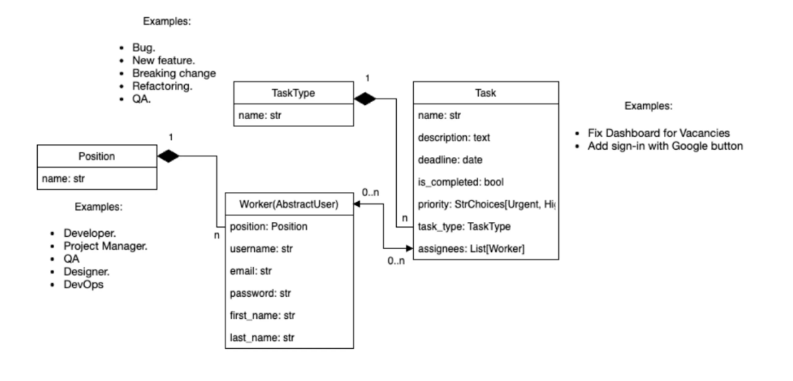

# TaskForge - Task Management System

## Overview

**TaskForge** is a task management system built with Django. It allows users to manage tasks, set deadlines, assign priorities, and track completion status. The application supports role-based user management, allowing workers to be assigned tasks based on their position and work type.

This project was created to help IT professionals organize and track tasks within a project. It is built using Django and follows best practices for development.


## Features

- User authentication with roles (Workers)
- Task management with priority, deadlines, and types
- Search and filter tasks by various attributes (e.g., priority, deadline)
- Assign tasks to workers
- Sorting tasks by different fields (e.g., deadline, priority)
- Responsive design with Bootstrap

## Technologies Used

- **Django** (Web framework)
- **SQLite** (Database for development)
- **Bootstrap** (Front-end framework)
- **HTML, CSS, JavaScript** (For user interface)
- **Python 3.x**

## Installation

### Requirements

Before you start, make sure you have Python 3.x installed. You can download it from [python.org](https://www.python.org/downloads/).

1. **Clone the repository**:
    ```bash
    git clone https://github.com/sashasyrota/Task-manager-for-IT-companies-TaskForge-.git
    ```
    cd TaskForge
2. **Set up a virtual environment**:
    ```bash
    python -m venv venv
    venv\Scripts\activate
    ```

3. **Install dependencies**:
    ```bash
    pip install -r requirements.txt
    ```

4. **Apply migrations**:
    ```bash
    python manage.py migrate
    ```

5. **Create a superuser** (for admin access):
    ```bash
    python manage.py createsuperuser
    ```

6. **Run the development server**:
    ```bash
    python manage.py runserver
    ```

7. **Access the application**:
    - Go to [http://127.0.0.1:8000/](http://127.0.0.1:8000/) in your browser.

## Usage

- Once the app is running, you can log in to the admin panel to manage tasks and users.
- You can add new tasks, set priorities, deadlines, and assign them to workers.
- Use the search bar to filter tasks by name or status.

## Admin Panel Access

- Go to [http://127.0.0.1:8000/admin/](http://127.0.0.1:8000/admin/) to access the Django admin panel.
- Log in with the superuser credentials you created.

## Running Tests

To run the tests, use the following command:

```bash
  python manage.py test